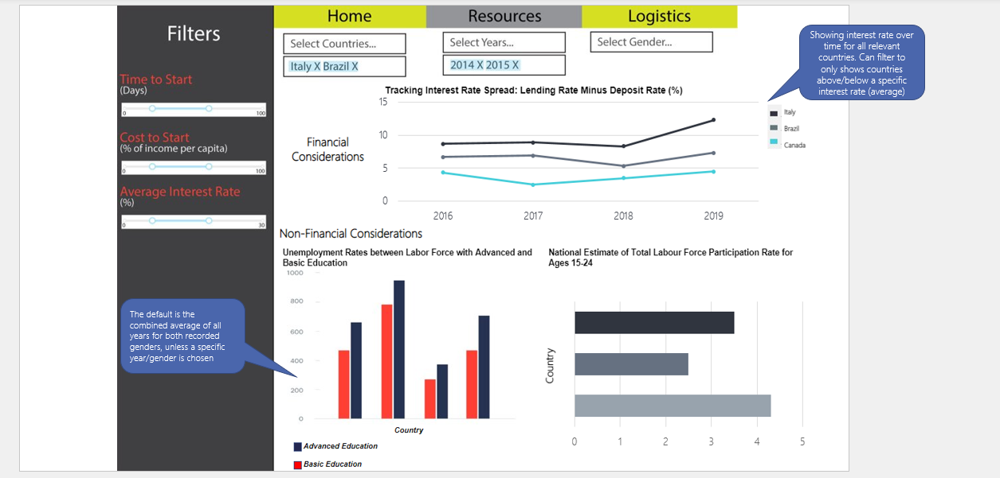
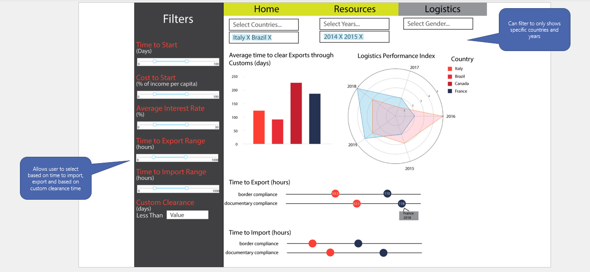

# New Venture(s) Compass

## Project Vision
Providing entrepreneurs with the necessary information to make informed decisions about which country to start a business in, by presenting them with comprehensive data on both external and internal factors affecting business development.

## Project Description
The app contains a landing page that gives descriptive information on data sources used and the different development indicators from Worldbank project whose purpose is to assess business environment in different countries. This enables the reader to gather all background domain information required to maximize understanding of the dashboard information.
The app has three different tabs for different functions – 1. Main: This gives brief recommendation on countries suitable for new ventures as per user’s expectations with respect to the cost for starting business and time required for starting business. 2. Resources: This page gives detailed information regarding financial instruments and labor resource status for the countries selected in Main page. 3. Logistics: This page gives detailed information regarding status of imports, exports and overall logistics picture for the countries selected in Main page. 
A dropdown menu which allows multiple selection provides ability for users to further narrow down selection to a few years or for specific countries or specific gender. Users can compare macro environment and economic statuses of different countries by navigating through different pages. 

Final goal is that these provide information for user to be able to select the exact country or countries for new ventures and investments.

## Sketches 
### Home Page

### Resources Page

### Logistics Page

## Addional Documents 
Please refer to the following documents for further information:

- [Contributing Guidelines](https://github.com/sahaavi/New-Venture-s-Compass/blob/main/doc/CONTRIBUTING.md)

- [Code of Conduct](https://github.com/sahaavi/New-Venture-s-Compass/blob/main/doc/CODE_OF_CONDUCT.md)

- [Team Contract](https://github.com/sahaavi/New-Venture-s-Compass/blob/main/doc/team-contract.md)
